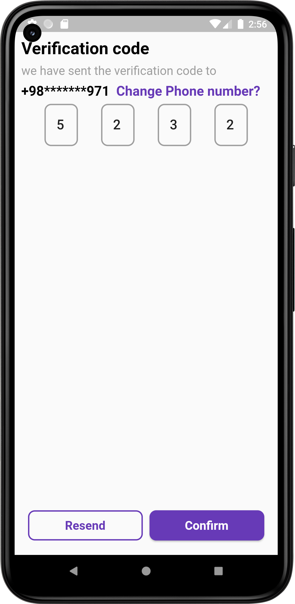
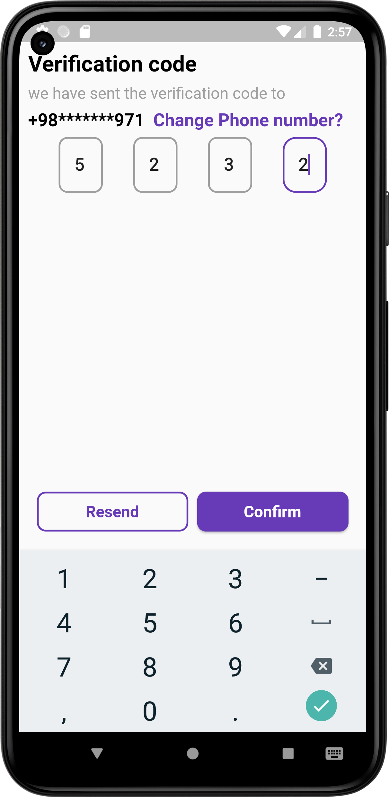
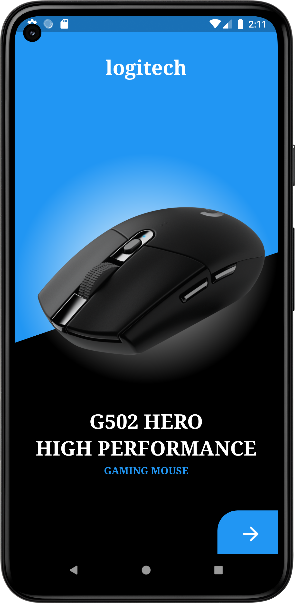
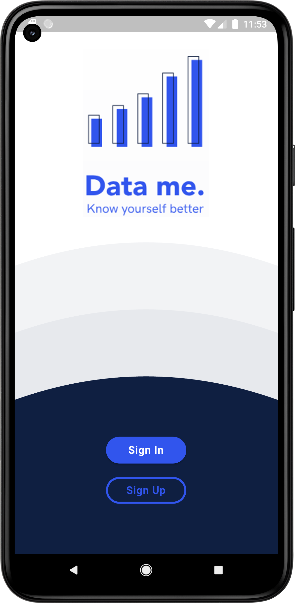
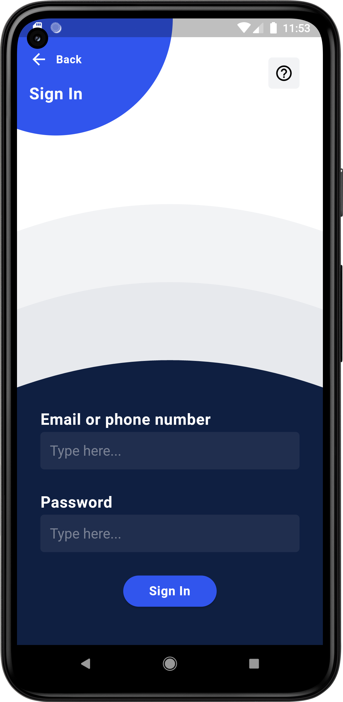
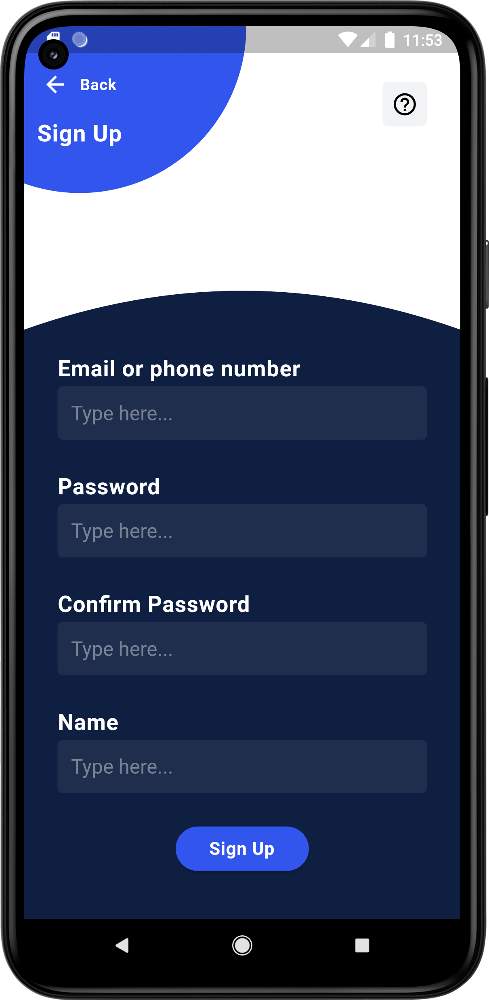

## <b>Flutter Examples</b>

#### Here you can find some Flutter test project.
 

<b>Screenshots:</b>  

 ### <b>Onboarding Screen</b>

 ### <b>Otp Verification Screen</b>

 ### <b>Simple Shop Screen</b>

 ### <b>Simple Signin Signup Screen</b>

